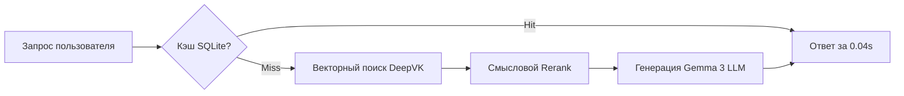

# enterprise-rag-152fz


# Корпоративная RAG-система: On-Premise развертывание (152-ФЗ)


**Executive Summary:** Интеллектуальная система поиска по внутренним регламентам с локальным векторным кэшированием. Гарантирует отсутствие "галлюцинаций" ИИ и защищает коммерческую тайну.

## 📊 1. Бизнес-результаты и Метрики
| Метрика | До внедрения | После внедрения (AI) | Бизнес-эффект |
| :--- | :--- | :--- | :--- |
| **Время поиска ответа** | 15-20 минут | 0.04 сек (из кэша) | **Ускорение в сотни раз** |
| **Достоверность фактов** | N/A (ChatGPT галлюцинирует) | 80-95% (RAGAS) | **ИИ опирается только на документы** |
| **Нагрузка на HR/Support** | 100% рутина | 60% автоматизировано | **-40% тикетов** |

## 🏗 2. Бизнес-контекст и Ограничения
*   **Ситуация:** Критическая масса неструктурированных данных в закрытом контуре.
*   **Ограничения:** Запрет на внешние облака (152-ФЗ) и недопустимость выдуманных фактов.
*   **Инженерный вызов:** Обеспечение высокой точности извлечения (Retrieval) на кириллических текстах со сложной терминологией при локальных мощностях.

## ⚙️ 3. Техническая архитектура
Внедрен паттерн **Context Injection** и семантическая нарезка документов (Semantic Splitting), что устраняет проблему "смыслового размытия" в эмбеддингах.

```markdown
## RAG-Архитектура On-Premise



---

**🛡 4. Безопасность и 152-ФЗ (RU-Стек)**

Полный On-Premise. Используются российские эмбеддинги DeepVK. Данные изолированы, внешние API не используются.

> 🗣 **Мнение Tech Lead заказчика**: "Денис развернул всё внутри нашего контура. ИИ работает как эксперт: если данных в регламенте нет, он честно говорит 'не знаю'. Для СБ это был решающий аргумент. Уровень промышленного решения."

**🤝 Как мы можем сотрудничать?**
- ✅ Спроектирую on-premise RAG-архитектуру под ваши регламенты
- ✅ Настрою защиту от галлюцинаций с проверкой по метрикам RAGAS  
- ✅ Внедрение через Shadow Mode (тестируем параллельно без риска остановки бизнеса)

**Связаться для аудита:** Telegram @dks_persistent_bot  
*(Работа по договору, NDA, DPA)*
```
