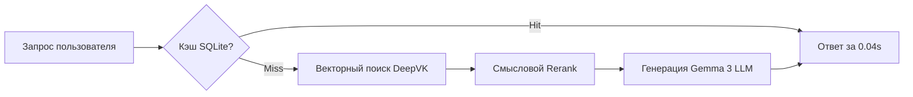

# enterprise-rag-152fz


# Корпоративная RAG-система: On-Premise развертывание (152-ФЗ)


# 📌 1. О проекте (Простыми словами)
**Какую проблему решаем?** 
Сотрудники крупных компаний тратят часы на поиск нужной информации в сотнях внутренних регламентов (PDF/Docx). Использовать публичный ChatGPT нельзя из-за риска утечки коммерческой тайны (нарушение 152-ФЗ) и критического риска того, что нейросеть «выдумает» несуществующее правило.

**Что делает этот проект:** 
Это интеллектуальная поисковая ИИ-система, которая разворачивается на собственных серверах компании. При запросе она находит точный абзац во внутренних документах и выдает краткий ответ со ссылкой на источник. Если ответа в регламентах нет — система честно отвечает «Не знаю», полностью исключая выдумки (галлюцинации).

---

## 🔒 2. Статус проекта и Развертывание (NDA)

> **⚠️ NDA Status:** Исходный код данного проекта является коммерческой тайной и защищен соглашением о неразглашении (NDA). В репозитории представлена архитектура решения, бизнес-метрики и обезличенные фрагменты конфигурации.

**Как система разворачивается на стороне клиента (On-Premise):**
Продукт поставляется как готовый к деплою контейнеризированный микросервис. Это исключает проблему «работает только на моем компьютере».
*   **Изоляция среды:** Индексатор базы знаний, векторное хранилище и API-сервер работают в независимых Docker-контейнерах.
*   **Безопасность ключей:** Все чувствительные данные вынесены в защищенный файл `.env`.

Запуск на сервере заказчика сводится к базовым командам администратора:

```
# Инициализация защищенного контура на Linux-сервере клиента
cp .env.production .env
docker-compose build --no-cache
docker-compose up -d
```
## 🛠 3. Стек технологий (Что и почему использовано)
Выбор каждого инструмента обусловлен требованиями надежности и Enterprise-безопасности:
ChromaDB: Легковесная векторная база данных. Почему: Позволяет хранить все эмбеддинги строго локально, гарантируя, что документы не покинут закрытый ИТ-контур компании.
DeepVK Embeddings: Модель векторизации. Почему: В отличие от OpenAI, работает локально (даже на CPU) и в разы точнее понимает специфический русский юридический и корпоративный язык.
Gemma 3 27B / GigaChat Pro: LLM для генерации ответа. Почему: Gemma разворачивается on-premise, а GigaChat сертифицирован для работы в РФ, что закрывает все требования 152-ФЗ.
SQLite (Кэширование): Почему: Сохраняет ответы на частые вопросы. Ускоряет выдачу до 0.04 сек и экономит вычислительные ресурсы серверов.
RAGAS Framework: Библиотека для математической оценки качества. Почему: Доказывает бизнесу цифрами, что ИИ опирается только на факты (метрика Faithfulness).
## 🏗 4. Архитектура системы
В проекте реализован паттерн Context Injection (принудительное добавление заголовков в каждый фрагмент текста), что устраняет проблему «смыслового размытия» эмбеддингов при поиске.

## RAG-Архитектура On-Premise




##  📊 5. Измеримые бизнес-результаты (ROI)
Метрика	До внедрения	После внедрения (AI)	Бизнес-эффект
Время поиска ответа	15-20 минут	0.04 сек (из кэша)	Ускорение в сотни раз
Достоверность (Faithfulness)	N/A (ChatGPT фантазирует)	80-95% (RAGAS)	ИИ опирается только на факты
Нагрузка на HR/Support	100% рутина	60% автоматизировано	-40% тикетов

##  📸 6. Доказательства работы (Proof of Work)
<p align="center">

<br>
<i>Рис 1. Автоматизированная оценка качества RAG-системы (фреймворк RAGAS). Подтвержденный уровень достоверности фактов (Faithfulness) — 80%+.</i>
</p>
<p align="center">

<br>
<i>Рис 2. Stress-test на галлюцинации: система отказывается генерировать ответ при отсутствии фактов в векторной базе, отвечая "Информации нет".</i>
</p>
##  🤝 Как мы можем сотрудничать?

✅ Проведу аудит процессов и спроектирую on-premise RAG-архитектуру под ваши регламенты.
✅ Настрою защиту от галлюцинаций с проверкой по метрикам RAGAS.
✅ Внедрение через Shadow Mode (тестируем систему параллельно с текущими процессами без риска остановки бизнеса).
Связаться для аудита:Telegram @dks_persistent_bot (Работа по договору, NDA, DPA).


**Executive Summary:** Интеллектуальная система поиска по внутренним регламентам с локальным векторным кэшированием. Гарантирует отсутствие "галлюцинаций" ИИ и защищает коммерческую тайну.

## 📊 1. Бизнес-результаты и Метрики
| Метрика | До внедрения | После внедрения (AI) | Бизнес-эффект |
| :--- | :--- | :--- | :--- |
| **Время поиска ответа** | 15-20 минут | 0.04 сек (из кэша) | **Ускорение в сотни раз** |
| **Достоверность фактов** | N/A (ChatGPT галлюцинирует) | 80-95% (RAGAS) | **ИИ опирается только на документы** |
| **Нагрузка на HR/Support** | 100% рутина | 60% автоматизировано | **-40% тикетов** |

## 🏗 2. Бизнес-контекст и Ограничения
*   **Ситуация:** Критическая масса неструктурированных данных в закрытом контуре.
*   **Ограничения:** Запрет на внешние облака (152-ФЗ) и недопустимость выдуманных фактов.
*   **Инженерный вызов:** Обеспечение высокой точности извлечения (Retrieval) на кириллических текстах со сложной терминологией при локальных мощностях.

## ⚙️ 3. Техническая архитектура
Внедрен паттерн **Context Injection** и семантическая нарезка документов (Semantic Splitting), что устраняет проблему "смыслового размытия" в эмбеддингах.

```markdown
## RAG-Архитектура On-Premise


**🛡 4. Безопасность и 152-ФЗ (RU-Стек)**

Полный On-Premise. Используются российские эмбеддинги DeepVK. Данные изолированы, внешние API не используются.

> 🗣 **Мнение Tech Lead заказчика**: "Денис развернул всё внутри нашего контура. ИИ работает как эксперт: если данных в регламенте нет, он честно говорит 'не знаю'. Для СБ это был решающий аргумент. Уровень промышленного решения."

**🤝 Как мы можем сотрудничать?**
- ✅ Спроектирую on-premise RAG-архитектуру под ваши регламенты
- ✅ Настрою защиту от галлюцинаций с проверкой по метрикам RAGAS  
- ✅ Внедрение через Shadow Mode (тестируем параллельно без риска остановки бизнеса)

**Связаться для аудита:** Telegram @dks_persistent_bot  
*(Работа по договору, NDA, DPA)*
```
